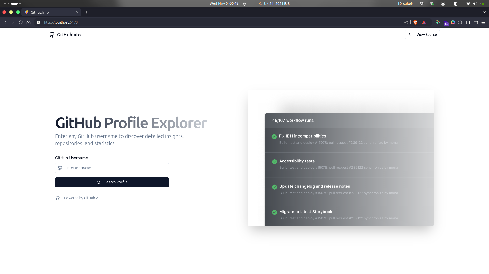
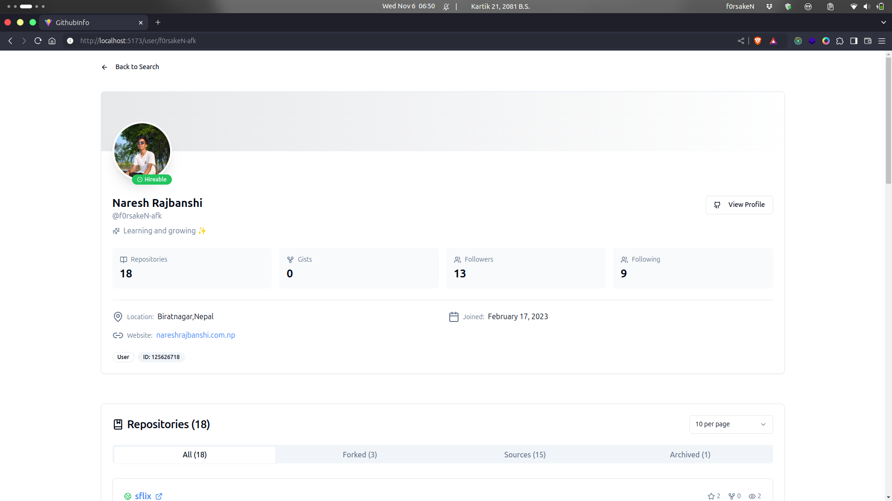
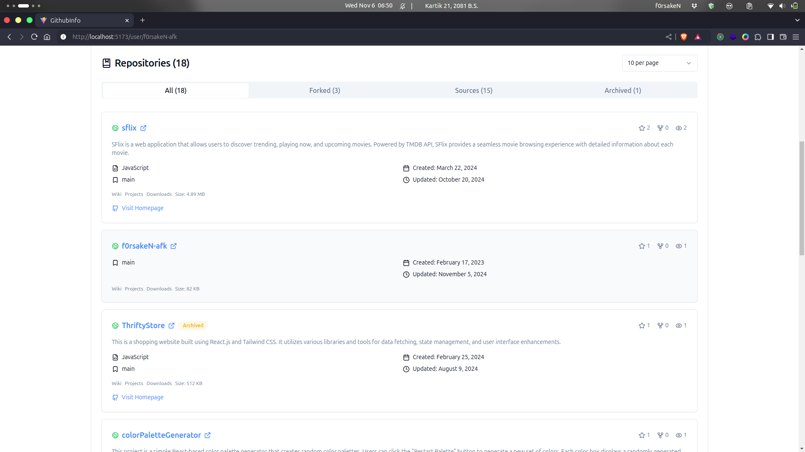

# GitHub Profile Explorer

 <!-- Add your project screenshot here -->

A modern, responsive web application built with React, TypeScript, and Shadcn UI that allows users to explore GitHub profiles and repositories in detail.

## 🌟 Features

### Profile Information
- Comprehensive user profile details
- Profile statistics (followers, following, repos)
- User bio and contact information
- Professional status (hireable indicator)
- Join date and activity status

### Repository Explorer
- Detailed repository listings
- Advanced filtering (All, Forked, Sources, Archived)
- Pagination with customizable items per page
- Repository statistics (stars, forks, watchers)
- Language and topic tags
- Comprehensive repository metadata
- Sort by popularity

### User Interface
- Clean and modern design
- Responsive layout
- Dark/Light mode support
- Loading states and error handling
- Smooth transitions and animations
- Intuitive navigation

## 🚀 Tech Stack

- **Frontend Framework**: React + TypeScript
- **State Management**: Redux Toolkit
- **Routing**: React Router DOM
- **UI Components**: Shadcn UI
- **Styling**: Tailwind CSS
- **Icons**: Lucide React
- **HTTP Client**: Axios
- **Form Handling**: React Hook Form

## Screenshots

### User Info

### Repo info
